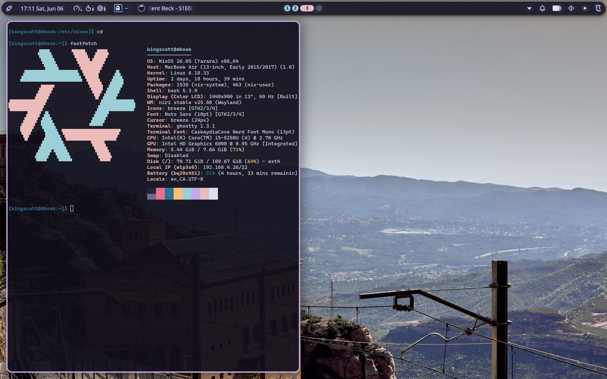

# kingscott.nix 

My personal NixOS setup.



## Layout

```
machines/       per-machine config and hardware
  dbook/        2015 MacBook Air
  framework/    Framework 13 (AMD Ryzen 7 7840U)
modules/
  common.nix    shared packages, desktop, and user settings
flake.nix       defines nixosConfigurations for each machine
```

## Secrets

Secrets live in `/etc/nixos/secrets.nix` (gitignored, not committed). WiFi is now managed by NetworkManager, so PSKs are stored under `/etc/NetworkManager/system-connections/` rather than in nix.

## Notes

- **dbook (2015 MacBook Air) wifi:** the Broadcom card won't associate with 802.11w (PMF) enabled. After adding the connection, disable PMF: `nmcli connection modify <name> wifi-sec.pmf 1` (1 = disable in NetworkManager).

## Rebuilding

```bash
sudo nixos-rebuild switch --flake .#dbook --impure
```

To update packages, refresh the flake inputs first:

```bash
nix flake update
sudo nixos-rebuild switch --flake .#dbook --impure
```

## Installing on the Framework 13

The `framework` host shares dbook's packages, desktop, and window manager; the
differences are the `nixos-hardware` Framework 13 (AMD 7040) module and its own
generated hardware config. `machines/framework/hardware-configuration.nix` in
the repo is a placeholder — regenerate it on the machine during install:

```bash
# from the NixOS installer, after partitioning and mounting at /mnt
sudo nixos-generate-config --root /mnt --dir /mnt/etc/nixos/machines/framework
sudo nixos-install --flake /mnt/etc/nixos#framework
```

Afterwards, rebuild with `--flake .#framework`.
